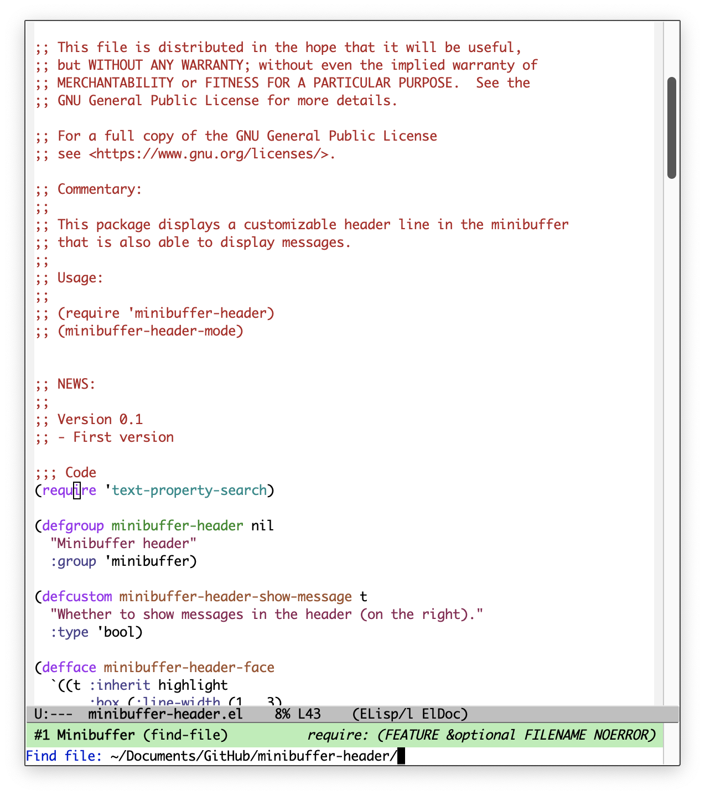
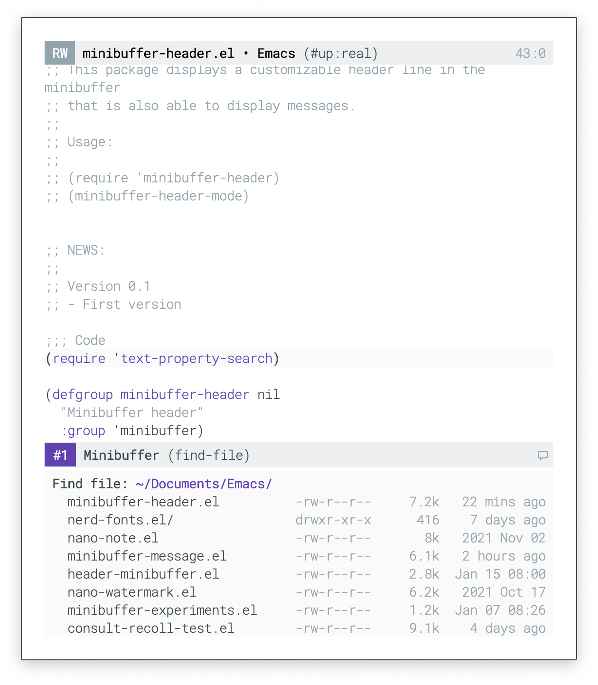

## Minbuffer header line

Minibuffer header line mode is a minor mode for GNU/Emacs that insert a header
line in the minibuffer.

### Installation

Install with:

```lisp
(package-install 'minibuffer-header)
```

### Usage example:

Activate with `M-x: minibuffer-header-mode`

### Screenshot

#### Vanilla Emacs
</img>

#### Nano Emacs
</img>


