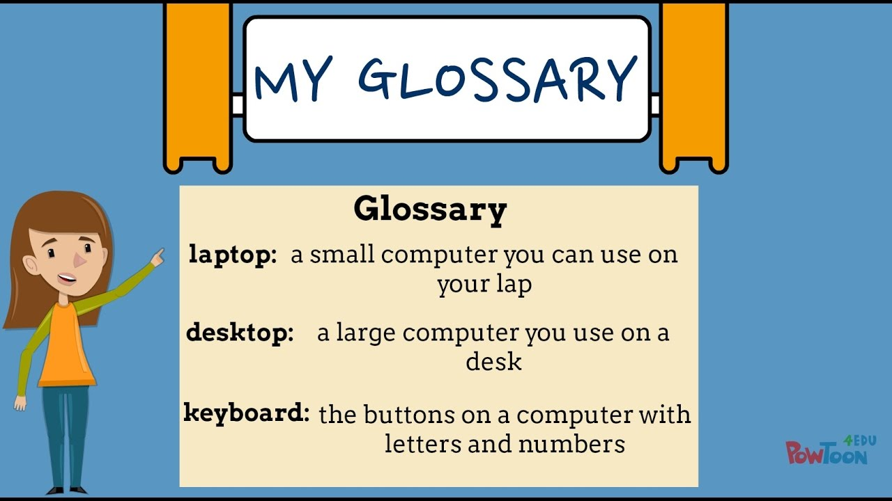

 

<https://youtu.be/BCPoKIE5y1U?t=159>

The language English changes all the time.

We live in times where English is changing more rapidly than ever before.

For that reason, it's important to maintain my own glossary (words I know, for
example).

It pegs an approximate model of my personal language.
